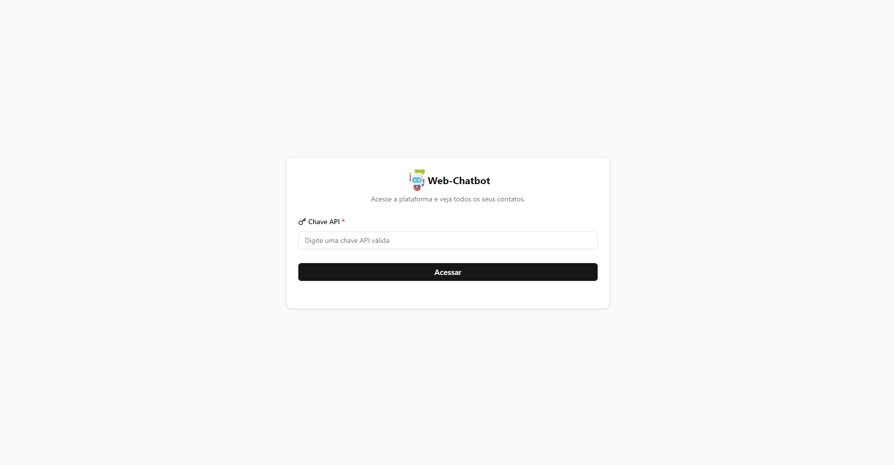

# Web-Chatbot
 🚀 Este repositório contém o código-fonte com aplicação que visa autenticar o usuário com uma chave de API fornecida pelo Blip, listar os contatos do chatbot e permitir a visualização das conversas completas de um contato selecionado. Cada rota foi implementada para atender requisitos funcionais específicos.<br><br>
<div>
    
   
</div><br>


> Neste desafio, o objetivo era desenvolver uma aplicação web para exibir contatos e conversas de um chatbot criado na plataforma Blip. A aplicação foi desenvolvida utilizando React, TypeScript, Tailwind CSS e a biblioteca de componentes ShadCN/UI.

 ## Tecnologias/Ferramentas Utilizadas :

 <div style="display: inline_block" >
    
    
    
    
</div>


## Como executar o projeto:

1. Clone do repositório :

```

$ git clone https://github.com/Dev-Messias/web-chatbot.git

```
> Acesse a página utilizando `cd web-chatbot`

2. Instale as dependências :

```

$ npm install

```


3. Iniciando o projeto :

```

$ npm run dev

```


 
